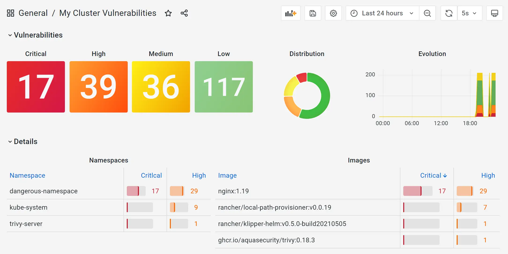

# Kubernetes Continuous Image Scanning System

Kciss (from french famous fruit "cassis") service scans regulary the container images used the underlying Kubernetes cluster, aggregates vulnerabilities statistics for the namespaces and images and exposes results to Prometheus.

The security scanning component is performed by [Trivy](https://github.com/aquasecurity/trivy), used in client-server mode.

Users can easily create alerts based on vulnerabilities found in their clusters workloads, or build vulnerabilities dashboards in Grafana such as this one:


# Usage

A complete example cluster with Prometheus and a fully provisioned Grafana (as shown above) can be built with:

```shell
k3d cluster create --config=k3d-cluster-config.yml 
kubectl apply -f k8s/
kubectl apply -f k8s/grafana-and-prometheus
```

Wait for all the pods to be up & running and open a web browser on http://localhost:16443/d/jJAl3im7z/my-cluster-vulnerabilities?orgId=1&refresh=5s
(Note: grafana is using admin/admin by default)